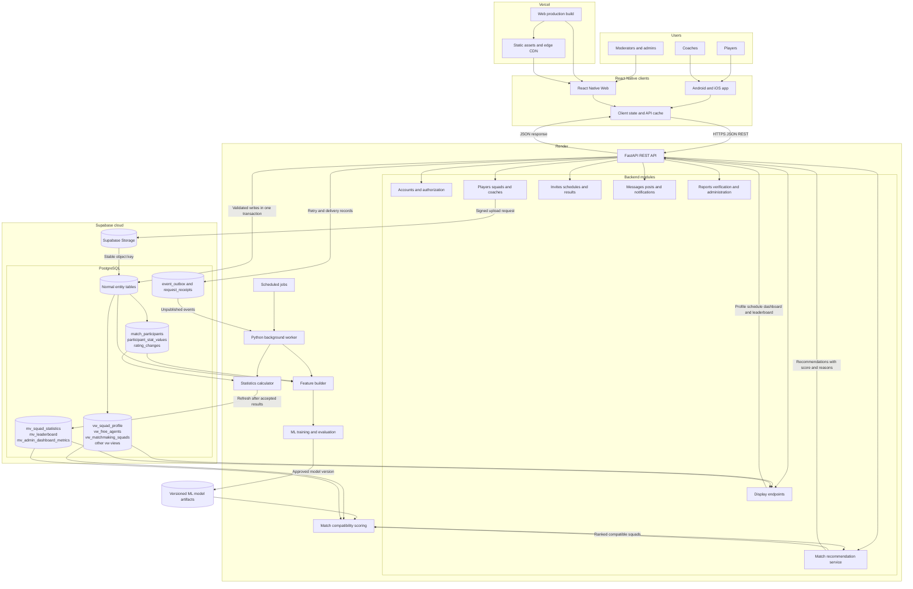
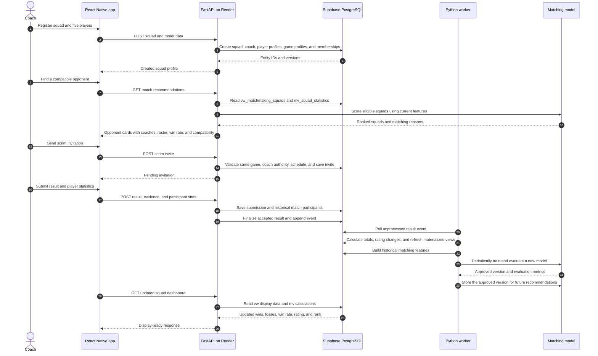

# ABYSS system architecture

This architecture uses one React Native codebase for Android, iOS, and web; FastAPI for the REST API; Python workers for statistics and matching; Supabase for managed PostgreSQL and object storage; Vercel for the web build; and Render for the API and background workers.

## Main system flow

## Database responsibility

| Purpose | ERD objects |
|---|---|
| Permanent identity | `users`, `player_profiles`, `player_profile_claims` |
| Per-game player data | `games`, `game_modes`, `game_roles`, `game_ranks`, `game_characters`, `player_game_profiles` |
| Squad history | `squads`, `squad_coaches`, `squad_memberships` |
| Match history | `scrim_invites`, `scrims`, `match_participants`, `scrim_results` |
| Flexible game statistics | `stat_definitions`, `participant_stat_values`, `rating_changes` |
| Live display data | `vw_*` views |
| Stored calculations | `mv_squad_statistics`, `mv_leaderboard`, `mv_admin_dashboard_metrics` |
| Reliable background processing | `event_outbox`, `event_receipts`, `request_receipts` |

The mobile and web clients call FastAPI for business data. They do not write directly to PostgreSQL. FastAPI checks the user, coach permissions, game compatibility, and record versions before changing normal entity tables. `vw_*` objects provide current denormalized display data, while `mv_*` objects hold calculations that workers refresh after relevant changes.

The first matching version should use deterministic filters and a weighted score: same game and mode, region, availability overlap, squad rating difference, recent win rate, completed-match confidence, and roster completeness. The ML model should be introduced after enough accepted match history exists. Train it asynchronously, version every model, compare it with the existing scoring baseline, and keep the REST request limited to inference so training never delays the user.

React Native Web is deployed to Vercel. Android and iOS builds are distributed as mobile applications; they still call the same Render API. Render should run the FastAPI web service separately from the worker and scheduled training process so API traffic cannot be blocked by statistics refreshes or model training.
