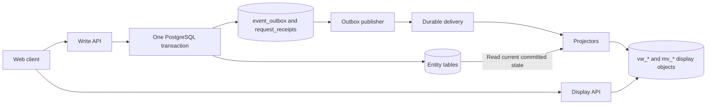

# ABYSS database design

Use PostgreSQL with normal entity tables for business state and small event-support tables for safe request retries and delivery. Normal entities remain in 3NF. Presentation objects use `vw_` for live denormalized views and `mv_` for stored denormalized calculations.

The SQL is a proposed **fresh-install baseline**, replacing the two-table design in this repository. It is not a data-preserving migration and does not implement application handlers, authorization, background workers or deployment roles. Those implementation contracts are specified below.

## 1. What the document establishes

Source: `C:/Users/YEN YEN/Desktop/ABYSS.pdf`, 42 pages. Page numbers below refer to PDF pages, not the repeated slide section numbers. Requirements were taken from both extracted text and the interface screenshots. Mock data, example dates, scores and demographic claims are not database requirements.

| PDF evidence | Required behavior | Authoritative tables |
|---|---|---|
| 12, 14-15, 40 | Guests, registered representatives, moderators, admins; sign-up/login | `users`, `user_roles`, `auth_tokens` |
| 16 | Squad name, acronym, description, level; coach-managed player profiles, game ID/zone, current/highest rank, stars, hero pool | `squads`, `squad_coaches`, `players`, `squad_roster`, `player_heroes`, catalogs |
| 17, 19, 26 | Squad search, custom skill range, opponent profile | `squads`, `squad_ratings`; `vw_squad_profile` and `mv_leaderboard` supply display data |
| 18, 26 | Squad statistics, player list, posts, image attachments, optional labels and visibility | `scrim_results`, `squad_roster`, `squad_posts`, `post_assets` |
| 20, 23-25 | Date/time, number of games, challenges, sent/received invites, scrim status | `scrim_invites`, `scrims`, `scrim_reschedule_requests` |
| 21-22 | Notifications and squad inbox | `notifications`, `conversations`, `messages`, `conversation_reads` |
| 27-30, 32-33 | Categorized feedback, squad reports and evidence | `feedback`, `reports`, `report_evidence` |
| 34 | Requested squad level, proof type/file, approval/rejection, action time | `squad_verifications`, `media_assets` |
| 35-37 | Scrim/invite logs, winner, scores, screenshot proof, OCR status, squad administration | `scrims`, `scrim_results`, `result_submissions`, `result_evidence`, `audit_log`, `sanctions` |
| 13, 38-40 | Leaderboard, events, promotional media, video/advert links, moderator accounts and admin notes | `rating_seasons`, `squad_ratings`, `content_items`, `user_roles` |
| 41 | No MLBB server/API integration; manual report review; squads negotiate late/missed schedules | Submitted evidence and reviewed results; negotiated rescheduling |

Successful submission pages (28 and 30) are UI states, not separate entities. Received and sent invites share one write record. Dashboard counts are projections, not independent editable totals.

## 2. Numbered SQL sections

Every table has a persisted `COMMENT ON TABLE`, so its purpose is available in PostgreSQL metadata and the ERD. The headings in `abyss.sql` use the requested numbered comments.

| Section | Purpose |
|---|---|
| 1 | Account and access |
| 2 | Reference data and uploaded files |
| 3 | Squad and player profiles |
| 4 | Matchmaking, invitations and schedules |
| 5 | Results, screenshot proof, OCR and ratings |
| 6 | Social feed and squad messaging |
| 7 | Notifications |
| 8 | Feedback, reports, verification and moderation |
| 9 | Admin content and audit history |
| 10 | Event delivery and request safety |
| 11 | Display views and materialized views |
| 12 | Operational contract |

## 3. Write and display boundary



The write API validates invariants against authoritative state. A display result may suggest a valid opponent but cannot authorize a challenge, accept an invitation, or finalize a result. The client never writes a `vw_*` or `mv_*` object. Authentication and authorization checks use current trusted state.

With one database, a worker can process an outbox event and its query changes transactionally without an external broker. Mark the event published only after every required local consumer succeeds. With a broker, `published_at` means the broker durably acknowledged delivery, not that all projections finished. Each consumer owns a separate durable subscription and acknowledges after its transaction commits. Avoid a runtime dual write to the business database and broker.

The separation is simple: entity tables accept writes; `vw_*` and `mv_*` objects serve display data. Event support keeps retries safe without changing that naming.

## 4. Important modeling choices and assumptions

**User, squad and player are separate.** A representative signs in as a user. A squad has one non-null owner and zero or more additional managers/coaches. A player can be registered on a roster without an ABYSS account. One user may own/manage multiple squads; the command must always specify the acting squad. A linked user owns at most one player profile in this baseline. If alternate game accounts are allowed later, remove that particular uniqueness restriction.

**Coach, roster and matchmaking are separate from ownership.** `squad_coaches` records the people who represent a squad. One active coach is marked primary; coaches can be granted roster, scrim and opponent-message permissions independently. The create-squad workflow must create its initial primary coach row in the same transaction. Every `squad_roster` row records the coach who added that player, and every scrim invite records the coach who sent it. Matchmaking reads `vw_matchmaking_squads`, which shows the primary coach, all active coaches and the complete current player roster. `messages` has a composite foreign key proving that the sender is a coach for the sending squad, while `vw_messages` displays both coaches and both squad names.

**Roster history is preserved.** End the old membership and insert a new row during a transfer. The baseline permits one active squad per player and at most one active captain per squad. These are explicit product assumptions, not established limits in the PDF. An exact roster size, substitute limit and captain requirement belong to configurable competition rules, checked before scheduling/starting; do not invent those limits from screenshots. Only the linked player or authorized current squad staff can edit a player; `created_by` is provenance, not permanent edit permission. Disputed profile ownership needs a moderator workflow.

**Three kinds of rank are different.** `game_ranks` represents self-reported MLBB rank; `squad_levels` represents the Amateur/Collegiate classification shown in the UI; `squad_ratings` represents an ABYSS competitive score. `mv_leaderboard` ranks the last of these. OCR does not turn a self-reported rank into an official API-verified value.

**A scrim is a series between exactly two squads.** `home` and `away` are stable score orientations, not map sides. An invitation becomes at most one scrim. The screenshot shows Best of 5; a series format and game count are stored separately. `fixed_games` additionally supports a drawn series, which appears in the mockup logs. This extension is a proposed policy. Individual game statistics, bans, picks and K/D/A are outside the documented scope; game-numbered proof is supported without claiming telemetry access.

**An end time is added for scheduling.** The UI only shows date, start time and game count. Reliable overlap checks need an end time, so the application must ask for an expected duration or show a configurable estimate for confirmation. Store exact instants and an IANA timezone for display. Do not derive timezone from the machine running the server. Default `Asia/Manila` follows the Philippine community scope, while regions/timezones permit expansion. Validate timezone names against PostgreSQL's timezone catalog.

**Availability is an optional extension.** Concrete availability windows support later discovery filters. Availability is not a reservation; accepted scrims reserve time. Recurring availability and tournaments can be added later without changing the invite/result core.

**Evidence is private.** SQL contains stable object keys and metadata. Store file bytes in object storage; serve short-lived authorized URLs. Report/verification proof must remain private and clean before use. Avoid exposing real names, MLBB IDs, credentials or evidence via public roster JSON. Public roster includes only approved game names, roles, displayed rank/stars, hero names and avatars.

**Moderation does not delete history.** Suspend/archive accounts and squads, preserve historical FK relationships, and use a retention/anonymization policy for personal data. `audit_log` captures actor, reason and correlation ID. Grant application roles INSERT/SELECT only on audit and rating-change tables. A PostgreSQL owner can still alter records; stronger tamper evidence would require a separate archive.

## 5. Command contracts: what SQL alone cannot enforce

`CHECK`, `UNIQUE` and foreign keys cover row validity, duplicates and referential integrity. Cross-table policies and state transitions must be enforced by transactional handlers, because a PostgreSQL CHECK cannot safely validate other table rows. See the [PostgreSQL constraint documentation](https://www.postgresql.org/docs/current/ddl-constraints.html).

| Command | Required behavior in one transaction |
|---|---|
| CreateSquad / TransferOwnership | Verify representative role and active account; create one owner or atomically replace owner; verify transfer acceptance; prevent duplicate owner/staff membership; write audit and outbox. |
| AddPlayer / TransferPlayer | Lock player; validate claimed account/zone and authority; close active roster row before inserting new membership; update affected squad versions and emit roster events. Never overwrite another squad's claimed profile just because the ID matches. |
| SendInvite | Verify acting-squad authority, both squads active, recipient distinct, future time, expiry, format and configured eligibility; store immutable proposed terms. A changed proposal cancels/replaces the old invitation. |
| AcceptInvite | Use the locking recipe below; recipient alone accepts; create a scrim, set accepted/responded fields, persist audit/receipt/events atomically. |
| RequestReschedule / AcceptReschedule | Only participants propose and the opposing squad accepts; check expected scrim version, expiry, eligible status and both calendars; lock in the same order as AcceptInvite. Preserve old/new times in audit; bump scrim version. |
| StartScrim / RecordNoShow / CancelScrim | Revalidate actor/participants, permissible transition, timing and reason; snapshot lineups from authorized current rosters; do not turn an unattended match into an automatic loss without a defined policy. |
| SubmitResult | Check participant/actor and eligible match status; allow immutable replacement claims; reject invalid game counts; require authorized proof when policy demands it. Only the submitter's pending claim is superseded. |
| FinalizeResult | Lock scrim/result and affected rating rows; require opponent confirmation or authorized moderator decision; never let the same squad self-confirm. Verify score equality to accepted submission, update result/status, rating ledger and audit/outbox atomically. Conflicting claims remain disputed until reviewed. |
| CreatePost / ChangePostVisibility | Verify acting squad and attachment ownership/scan/access scope; require text or an attachment; increment aggregate version and emit event; enforce immediate visibility revocation as described below. |
| SendMessage / MarkConversationRead | Verify active squad authority and participant pair; allocate sequence under conversation lock; monotonic read cursor cannot exceed an existing visible sequence. |
| VerifySquad / ResolveReport / IssueSanction | Recheck current staff role; require reason and evidence access; prevent self-review/conflicts of interest; update both decision and affected squad/account state in one transaction. |
| GrantModerator / PublishContent | Admin-only; no public registration path can grant staff roles. Validate content audience and URL protocols. |
| MarkNotificationRead | Recipient-only; update command record first, then emit an event. Notification payload never grants permission to execute its action. |

For every aggregate update: `UPDATE ... SET version = version + 1, updated_at = now() WHERE id = :id AND version = :expected_version RETURNING version`. Zero returned rows means a conflict, not success. Tables without their own version are children protected by their aggregate lock/version, or use atomic cursor/unique-key operations. Notifications use idempotent recipient updates; result evidence is a child of the submission/scrim. Versions and timestamps are not automatically maintained by the DDL.

**Invite acceptance and schedule conflicts.** Begin with an advisory transaction lock keyed by `(actor_user_id, idempotency_key)` when retry-safe commands are used; check a saved receipt and request hash. Read immutable invite participant IDs, then lock both `squads` rows in ascending UUID order. Next lock the invite row, revalidate participants and state, and lock the scrim if updating one. Use the same ordering for all scheduling commands; never lock an invite first in one path and a squad first in another.

Under READ COMMITTED, after obtaining squad locks, execute a fresh statement checking both home and away indexes for an overlap:

```sql
-- Bind all values; exclude the current scrim during a reschedule.
SELECT id
FROM scrims
WHERE status IN ('scheduled', 'in_progress')
  AND (home_squad_id IN (:squad_a, :squad_b)
       OR away_squad_id IN (:squad_a, :squad_b))
  AND scheduled_start < :proposed_end
  AND scheduled_end > :proposed_start;
```

The interval is half-open: one scrim may start when another ends. A running scrim whose estimated end has passed requires extending its reservation or manually resolving its state before a new match starts; StartScrim also checks for another running scrim. Pending invitations do not reserve calendars. The query alone does not prevent races: **every scheduling writer must acquire the same squad locks**. If writing outside handlers will be permitted, introduce a booking table and an exclusion constraint via `btree_gist`, or a database procedure that owns all scheduling writes. This baseline does not claim to prevent overlaps from arbitrary direct SQL.

After all checks, create the scrim with copied immutable terms, update the invite, append audit and outbox rows, and insert the completed `command_receipts` response. Commit once. A crash before commit leaves no partial match; a retry after commit returns the same scrim ID. Retain command receipts for the full supported retry window; after expiry, uniqueness on `scrims.invite_id` still prevents a second match. Anonymous registration has separate email uniqueness/rate limiting; this user-keyed receipt table applies after authentication.

**Results and series scoring.** For Best of N, N is odd, the winner has exactly `floor(N/2)+1` game wins, and the loser has fewer; a completed best-of series cannot draw. For fixed N, the total wins equal N and ties are permitted only by configured rules. Void results do not affect standings. Do not finalize zero-zero placeholder rows just because the mockup labels them Draw. `scrim_results` references a submission for the same scrim through a composite FK; the handler must additionally verify scores match that claim and the submitted squad belongs to the scrim.

**Rating policy remains a product decision.** The PDF establishes skill-based pairing and a leaderboard but not Elo/Glicko, initial score, minimum matches, decay, seasons or tie-break rules. The schema stores an algorithm version and configurable rules without pretending one is specified. Proposed MVP: deterministic series-based rating, one configured active season, stable squad-ID tie breaking, and platform win rate `100 * wins / NULLIF(wins + losses + draws, 0)`; show an unrated marker when the denominator is zero. Count series, not individual games. Use accepted result finalization time to assign a season and retain that assignment on correction. Publish eligibility and formula before launch.

At finalization create two `rating_changes` rows and update both rating states while holding locks in deterministic `(season_id, squad_id)` order. The unique result-version keys prevent a retry from applying the same change twice. Corrections must retain the previous canonical result in audit, increment result version, supersede the old claim and append correction effects. For order-dependent formulas, recompute subsequent affected results in a defined chronological order; merely subtracting an old Elo delta is not a correct replay. Pause rating publication during such a rebuild and emit completion events afterward. Alternatively adopt an explicitly published adjustment policy. Decide this before enabling moderator result corrections.

## 6. Projection ownership and update dependencies

| Read model | Sources and triggers | Typical screen |
|---|---|---|
| `squad_directory` | Squad/profile/roster/player/hero/media/verification/sanction changes; finalized or corrected results; rating/season changes | Search, matchmaking, public profile and home statistics |
| `squad_schedule` | Invite acceptance, scrim state/time/result changes; opponent rename | Scrims and calendar |
| `invite_inbox` | Invite state changes, expiry; opponent rename | Received and sent invites |
| `leaderboard` | Finalized/voided/corrected results, rating rebuild, season boundaries, squad rename/region/status | Public standings |
| `profile_feed` | Posts, visibility, attachments, asset cleanup, squad rename | Profile/home feed |
| `conversation_inbox`, `message_history`, `user_conversation_state` | Messages/deletions, conversations, read markers and squad rename | Inbox, chat history and unread counts |
| `notification_inbox` | Notification creation and recipient read state | Notification panel |
| `moderation_queue` | Reports, feedback, verification, result submissions/reviews, squad rename | Staff queues |
| `activity_log` | Durable audit append | Scrim, invite and administrative history |
| `content_cards` | Publication/edit/archive/asset/audience changes; time windows checked at request time | Guest page and staff notes |
| `dashboard_metrics` | Scheduled authoritative recomputation; relevant events trigger refresh | Staff dashboard |

The query service can use dedicated SELECT-only query handlers over command tables for low-volume staff details, squad-account administration, availability and reference-data lists. This still preserves CQRS at the application boundary and avoids precomputing unused screens. If using a physically separate read database, first add projections for those endpoints (including current scrim scores and OCR evidence status); they are explicit remaining dependencies of a full read-database split. Give only the staff-detail service SELECT on the required non-secret source tables, never credentials or unrestricted client SQL.

`public_roster`, attachment arrays and OCR/event payloads use JSONB deliberately: they are read snapshots or variable external output. Memberships, invitations, scores and authorization remain normalized. Use `to_tsvector('simple', ...)` for the directory search document so squad names are not language-stemmed. Full-text search handles tokens, not arbitrary infixes; introduce a trigram index only if the actual search UX needs substring matching.

**Reliable refresh algorithm.** For the initial state-based projectors, serialize refreshes per target projection key using query-database transaction/advisory locks, then fetch the latest authoritative data from a fresh primary snapshot, then upsert or delete the projection, and insert its `processed_events` receipt in the same query transaction. Acquire the projection lock **before** reading source state. Do not apply old event payload values over newer joined data. An event can refresh a newer state than the event itself; that is intentional. An old event processed late will also read current state. A duplicate receipt skips only that event and projection generation. When one event updates many target rows, process them in stable key order; for very large fan-out use durable per-target work records before acknowledging the source event.

Keep `processed_events` in the query database when splitting storage; an outbox-side receipt would reintroduce an unsafe cross-database commit. Use fresh primary snapshots, not a lagging replica, for these refreshes. Read-model `scrim_version` and `invite_version` track their primary aggregate only: a squad rename can change a joined label without changing either number, so those numbers alone cannot suppress joined-data updates.

**Outbox delivery.** Claim due rows with `FOR UPDATE SKIP LOCKED`, set a lease owner/expiry and increment attempts in a short transaction, then publish outside that transaction. Mark published only with the current lease token after durable acknowledgement. A lease expiry recovers crashed publishers; a crash after broker acknowledgement can produce a duplicate, which receipts handle. Preserve per-aggregate `(version, event_index)` order: block later unpublished events behind an earlier failed/leased event and use the aggregate as broker partition key. Do not assume timestamps, UUIDs, or a sequence allocation reflect commit order. Retry with backoff; dead-letter after an operational threshold and alert. A dead-lettered predecessor blocks ordered later events until repaired/replayed. [PostgreSQL SELECT locking](https://www.postgresql.org/docs/current/sql-select.html) documents SKIP LOCKED for queue-like work; it is not a general consistent-read mechanism.

Notification creation is a command-side consumer: insert `notifications` with its event dedupe key and a new outbox event in the same transaction. Ignore duplicates without emitting a second notification-created event. Do not put authoritative notification writes inside a query-only projector. OCR similarly has a command-side worker that records output and emits evidence-updated events. The supplied schema does not include these workers.

**Read your writes.** Return the authoritative entity ID/version and updated command result to the caller. The UI can update immediately, show synchronization state and poll until the relevant projection reaches the expected version. Multi-source profile freshness uses a projection receipt/event token rather than a squad version alone. Never claim every read is strongly consistent; expose `projected_at` when freshness matters.

**Privacy and access changes.** Projected role/staff state must not be used as the sole authorization source. Check live ownership/staff/suspension status before protected reads. For post visibility changes, account closure, content unpublication or asset withdrawal, deny access using current authoritative state or a synchronously maintained revocation gate until projection/cache invalidation has completed. Failure to reach that gate must fail closed. Public CDN files cannot be made private by changing one SQL field; keep revocable attachments behind controlled delivery and purge caches. Do not embed private proofs in events, logs, public JSON or chat previews.

**Rebuilds and deletions.** These are state projections, so retained command data and durable audit records are the rebuild source; the outbox is not a permanent event store. In the initial deployment, use a maintenance window: stop writes, drain outbox, build a fresh query schema/generation from a consistent source snapshot, validate row counts and switch queries atomically, then resume writes. Later, an online rebuild needs a snapshot tied to a real CDC/log position, buffering changes during snapshot load and applying deletes before cutover; `MAX(event_id)` or an identity high-water mark is unsafe. Retain dedupe receipts at least as long as broker replay/redelivery retention, or replay could reapply side effects. Hard-deleted projections must stay deleted under old events by refreshing current source absence; preserve tombstones if moving to payload-based projections. Durable audit/notification history must be retained for as long as the product promises it in rebuilt views.

## 7. Scaling path

1. **Initial deployment:** one PostgreSQL instance, separate schemas and application modules, connection pooling, background workers and object storage. Set backup/PITR and restore procedures. Seed approved regions, ranks, squad levels, heroes and rating rules through migrations. Keep catalog changes audited and emit events for affected projections.
2. **Read growth:** profile query plans and slow queries; index the actual filters; use keyset pagination `(created_at, id)` or `(scheduled_start, scrim_id)`. Cache public cards/standings and use read replicas for tolerant reads. B-tree indexes already cover pending invites, calendar lookups, unread notifications and leaderboard order; GIN covers squad search.
3. **Worker growth:** parallelize across independent aggregates, keep per-conversation sequencing and per-squad schedule locks. Measure oldest unpublished event age, queue depth, retry/dead-letter counts, projection lag, lock wait time and slow queries. A starting freshness target such as p95 under 2 seconds is an operational goal to benchmark, not a guarantee from this schema.
4. **Storage growth:** archive old tokens/receipts and delivered outbox rows only after retention requirements; consider partitioning messages, audit and notifications when volume/query plans justify it. PostgreSQL partitioned uniqueness often requires the partition key; design the migration and foreign keys before partitioning. Avoid speculative sharding or monthly partitions on every small table.
5. **Independent query storage:** complete staff/availability/catalog projection coverage, move query tables plus `processed_events` together, preserve subscriptions, dependency refresh and revocation checks. No query-to-command FK needs removal. The command model remains one transaction boundary while cross-squad scheduling and results require it.

## 8. Deployment boundaries and decisions still needed

Use deployment migrations to grant minimum permissions. The browser has no SQL credentials. Ordinary query API gets SELECT on allowed query tables; staff query API additionally gets narrowly scoped source SELECT for the low-volume detail endpoints described above. Command API cannot write query models. Workers get only their assigned command/projection operations. Database ownership and role administration are reserved for migrations. Shared PostgreSQL schema names alone do not enforce application permissions.

The PDF does not settle: exact roster limits, allowed player roles, initial competitive rating/formula, season calendar, minimum leaderboard participation, draw/no-show policy, evidence requirements, visibility options beyond public/squad, record retention, or whether a player may join multiple active squads. The SQL makes its proposed assumptions visible and avoids hardcoding a fabricated MLBB rank list. Confirm these policies before production implementation; none prevents reviewing or using this schema as the design baseline.

No paid plans, payments, tournament bracket system, official game telemetry, matchmaking machine learning, or automatic bans are implied by the document, so they are not modeled.
